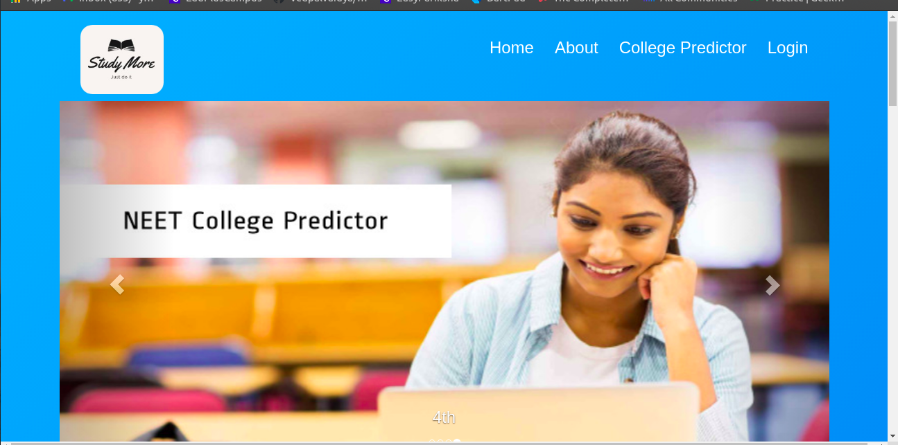
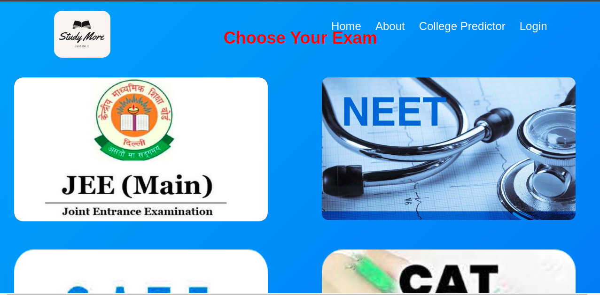
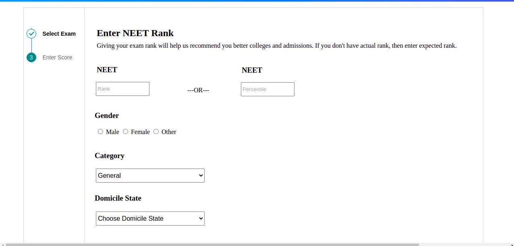
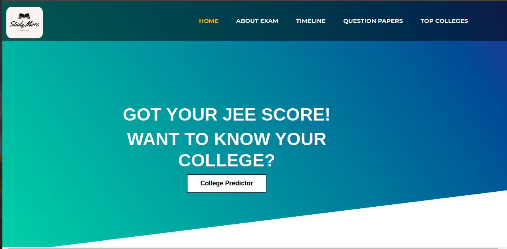
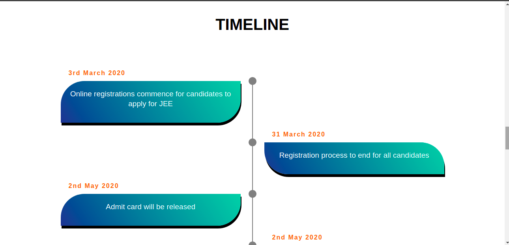
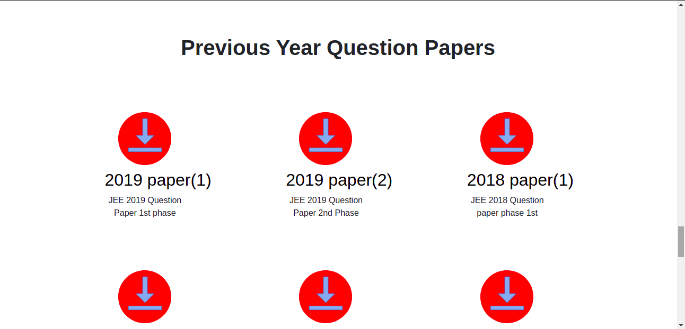

<h1>Competative-Examination Web-Apllilcation StudyMore </h1>
<h3> I have developed only the frontend part for this application with Html and Css
  This is my first step towards learning Web-devlopment </h3>
  
<h2> Glimpse of Web-Pages </h2>
<h2> Home page </h2>

 <h3> The application also has college predictor </h3>

 <h3> Each exam has its own page which shows info about exam </h3>

<h3> Timeline </h3>

<h3> Previous year Question Papers </h3>

<h3> Learnt many things and enjoyed a lot while making these templates </h3>
